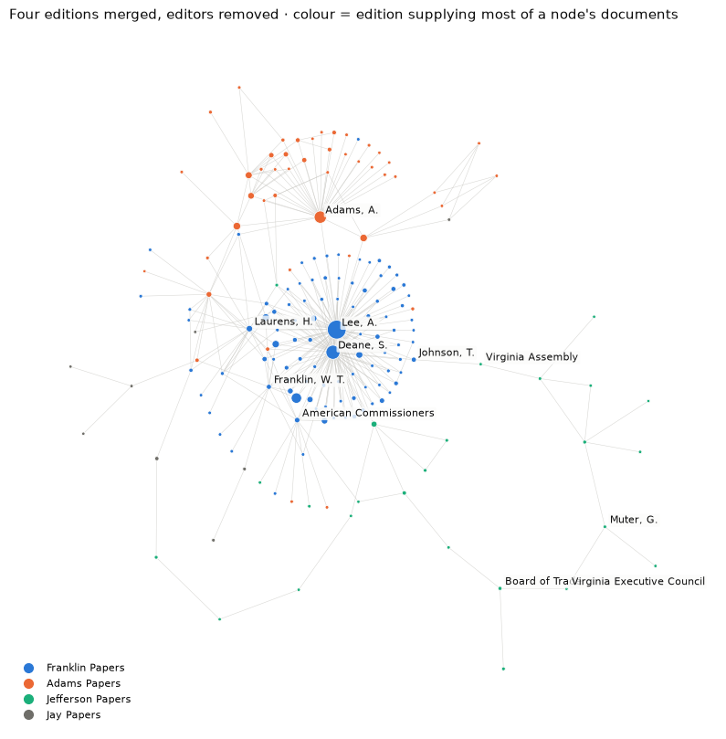

# From Letters to Networks

A weekly classroom lab on historical correspondence networks, with source-based writing completed after the 90-minute session.

[Open the browser lab](https://conradcompagna.github.io/letters-to-networks/explorer/)

**Course:** Natural Language Processing and Large Language Models for Historical Research · **Level:** upper-year undergraduate or MA; no programming experience needed · **Format:** Jupyter notebook plus a browser explorer · **Data:** 20,747 documents from the Franklin, Adams, Jefferson and Jay Papers on Founders Online, 1777–1784



The lab is about method. Diplomacy in Paris, Madrid and The Hague supplies the case because it is well documented in four overlapping editions, and that overlap produces the problems every correspondence project meets: documents that are not letters, groups that are also people, the same person under several names, the same letter printed twice, and networks whose shape is set by whose papers were collected.

## Learning goal

Students learn how to build and analyze a correspondence network: read letters, identify writers and addressees, draw directed ties, then use degree, betweenness, communities, and source links to interpret the larger network. The notebook extends this with name reconciliation, duplicate detection, and sensitivity checks.

## Notebook route

| Stage | Task |
|---|---|
| 1 | Decide which documents can become correspondence records |
| 2 | Reconcile names across sources |
| 3 | Turn records into edges |
| 4 | Examine one edition's network |
| 5 | Remove the edition's central figure |
| 6 | Merge four editions and inspect duplicates |
| 7 | Interpret communities |
| 8 | *(optional)* Trace change over time |
| 9 | *(optional)* Test ranking stability |
| 10 | Write a source-cited memo |

The notebook is a separate computational route through the dataset. Students answer seven short questions (two more in the optional stages) and write the memo.

## Browser workshop

The browser lab starts with an empty graph and ten complete letters. Students read each letter, identify its writer and addressee, record the evidence for that identification, and add the directed tie. They can check the 1830 edition's printed heading when the body alone does not identify an addressee. The ten letters are matched to records in the full Founders Online metadata corpus.

After all ten letters, students compare their graph with the catalog's author–recipient coding for those same letters, then reveal the four-edition network. They switch between degree, betweenness, and community views, inspect correspondents and linked documents, and write a 500-word response about how those measures change their interpretation of historical roles. The downloaded assignment includes their ten coding decisions and response for submission through a course site. Progress is stored in the browser. The notebook remains the longer computational route through the full dataset.

## Run it

```bash
git clone <this repository>
cd letters-to-networks
python -m pip install -r requirements.txt
jupyter lab lab.ipynb
```

The notebook runs offline on the bundled data in about 1–2 minutes on a laptop. It is saved with all outputs, so it can be read on GitHub without running it.

**Explorer.** Open `explorer/index.html` directly in a browser or use the GitHub Pages link above. The ten complete letters, graph builder, comparison, four full-network views, and writing area work offline. Linked source volumes and Founders Online records need internet. Progress is saved locally in the browser; students download a text file to submit through their course site.

## Repository

```
lab.ipynb                    the student notebook (executed)
netlab.py                    every function the notebook uses, with docstrings
explorer/index.html          browser explorer; explorer/data.js is generated
explorer/starter_data.js     ten complete letters and catalog comparison, generated by build_starter.py
explorer/builder.js          interactive student graph and comparison
explorer/workshop.js         guided full-network analysis and export
data/records.csv             the record table
data/name_authority.csv      name decisions with reasons
data/starter_letters.json    full public-domain letters from Sparks's 1830 edition
data/README.md               provenance, transformations, limitations
instructor/TEACHING_GUIDE.md schedule, preparation, likely difficulties, discussion
instructor/ANSWER_KEY.md     expected outputs and model answers
scripts/build_records.py     rebuilds data/records.csv from the Founders Online metadata
scripts/build_explorer.py    rebuilds explorer/data.js
scripts/build_starter.py     rebuilds explorer/starter_data.js
```

## Technologies

Python (pandas, NetworkX, scikit-learn, matplotlib), Jupyter, and a dependency-free HTML/Canvas explorer.

## Data and credit

Metadata from [Founders Online](https://founders.archives.gov), National Archives and University of Virginia Press. The editions are *The Papers of Benjamin Franklin* (American Philosophical Society and Yale University), *The Adams Papers* (Massachusetts Historical Society), *The Papers of Thomas Jefferson* (Princeton University) and *The Selected Papers of John Jay* (Columbia University). See [`data/README.md`](data/README.md).

Lab design and code: Conrad Compagna.
